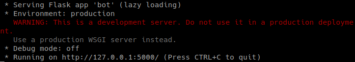
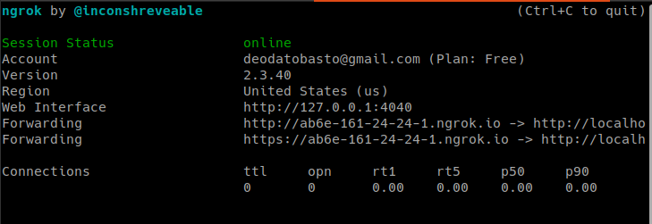
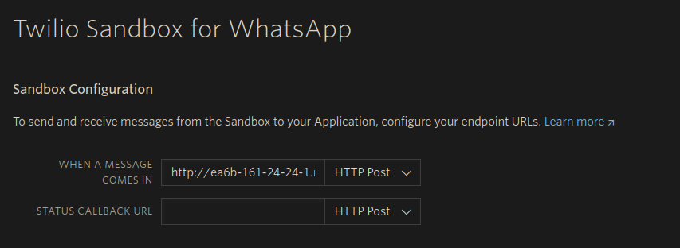

# Medical Clinic chat bot

This is a simple chat bot for a medical clinic. I do that for learn more about chat bot and automations. I wish this help someone. :)

I use python because, it is a simple language to use and has several libraries to help its user.


# Table of Contents

<!--ts-->
* [About](#medical-clinic-chat-bot)
* [Requeriments](#requeriments)
* [Author](#author)
<!--te-->

# Requeriments

## Clone repo

To start you will need install some tools:
To download this repo, you will need [Git](https://git-scm.com).

If you are in Linux, can just type that in terminal:

```bash
sudo apt install git # If you aren't in Ubuntu, the command maybe may change
```

You need to clone this repo.

If you wish to use HTTPS:

```bash
git clone https://github.com/DeodatoBastos/chat_bot.git
```

If you wish to use SSH:

```bash
git clone git@github.com:DeodatoBastos/chat_bot.git
```

To open the folder simply type:

```bash
cd chat_bot
```

## Python and venv

After that, you must install [Python](https://www.python.org/downloads/)

Now you cam create a virtual environments for downloads librarys onlu localy. You can read a tutorial [here](https://docs.python.org/3/library/venv.html).

In a simple version, code that on terminal:

```bash
# in linux
python3 -m venv name_of_venv
source name_of_venv/bin/activate # activate venv

# in windows
c:\>c:\Python35\python -m venv c:\path\to\myenv
C:\> name_of_venv\Scripts\activate.bat # activate venv
```

another requeriment is install some libraries:

```bash
pip install -r requirements.txt
```

## Desktop App version

Now you can run both codes. To do it, just type in terminal that:

```bash
cd app_bot
python app.py
```

## WhatsApp version

If you wish to run WhatsApp bot more steps will be necessary.

Install [Ngrok](https://dashboard.ngrok.com/get-started/setup) and Create a accont on [Twilio](https://www.twilio.com/try-twilio). After that, [configure](https://console.twilio.com/us1/develop/sms/try-it-out/whatsapp-learn?frameUrl=%2Fconsole%2Fsms%2Fwhatsapp%2Flearn%3Fx-target-region%3Dus1) your bot.

Now just type, to run the code:

```bash
cd whatsapp_bot
python bot.py
```

Then the code will generate a local host:


In this exemple the local port is 5000, so in the folder containing ngrok, type:

```bash
./ngrok http 5000
```

And a similar window will open:


Then, copy the first link and copy in [this](https://console.twilio.com/us1/develop/sms/settings/whatsapp-sandbox?frameUrl=%2Fconsole%2Fsms%2Fwhatsapp%2Fsandbox%3Fx-target-region%3Dus1) page and save.

Like that:


There, now you can use your chat bot. :)

# Author

Get in touch with me:

[](https://www.linkedin.com/in/deodato-bastos/) [](mailto:deodatobasto@gmail.com)